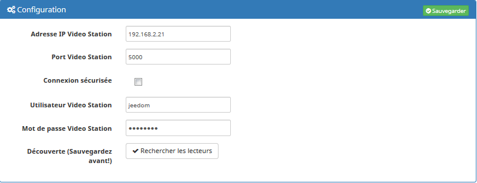
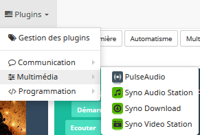
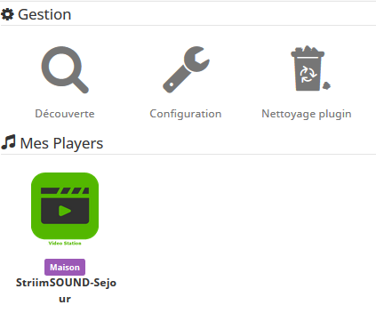
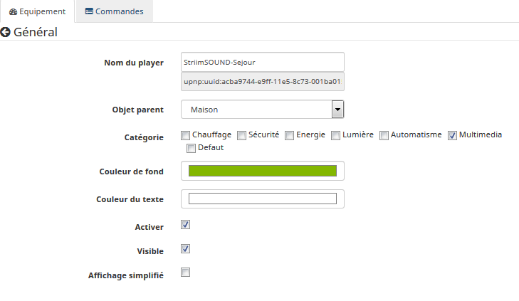
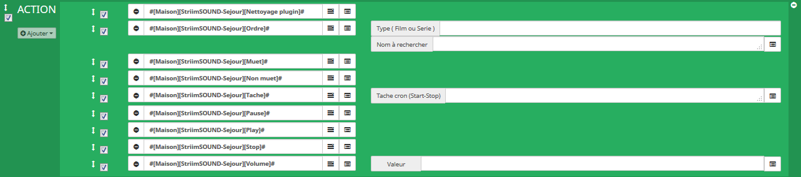

Le plugin Synoaudio permet de se connecter à votre nas et de contrôler Audio Station ainsi que vos lecteurs compatibles. Il va vous permettre de voir l'état d'un lecteur et d'effectuer des actions dessus (lecture, pause, suivant, précédent, volume, choix d'une playlist...)

Configuration
=============

Après téléchargement du plugin, il faut activer celui-ci:

Renseignez l'adresse IP ou DNS et le port de votre nas hébergeant Synology VideoStation, l'utilisateur et le mot de passe pour se connecter. Le mode sécurisé permet de passer les requêtes en https (Verifier que le port soit bien le port https). Dans un premier temps vous devrez sauvegarder et ensuite vous pourrez lancer une découverte des lecteurs compatibles avec VideoStation.(Veillez à ce que vos lecteurs soient allumés pour qu'ils soient découverts)

Ensuite rendez-vous dans l'onglet du plugin pour affecter un objet(pièce) à vos lecteurs et sauvegardez.

Configuration des équipements
-----------------------------

La configuration des players est accessible à partir du menu plugin : 

Voilà à quoi ressemble la page du plugin (ici avec déjà 1 player) : 

Affectez un objet (pièce) à vos lecteurs (si ce n'est pas fait en automatique), une couleur (si besoin) et le type d'affichage. Ensuite ,sauvegardez.
La fonction 'nettoyage plugin' permet de supprimer les vignettes des films et des séries, elle est accessible depuis le panneau du plugin et par une commande.

> **Tip**
>
>Les lecteurs s'activent ou se désactivent automatiquement en fonction de leur disponibilités, la tuile se grise et devient inerte.

Intégration dans un scénario 
----------------------------

Toutes les actions sont disponibles via scénario, exemple : 

Ordres particuliers
-------------------

* Dans les scénarios, vous avez accès a des commandes particulières :   
- 'Ordre' : Permet de demander a jeedom de chercher et de mettre en lecture un film ou une serie en fonction d'un ou plusieurs mots (Attention à l'orthographe).
- 'Tache' : Permet de réduire la charge de jeedom et du NAS en stoppant la tache programmé (cron).
	
FAQ
===

* Lenteur de jeedom et/ou du Nas depuis que le plugin est installé :  
Le plugin fait des appels réguliers au nas pour remonter toutes les informations utiles. Il est possible de modifier le paramètre de la tache planifiée, Général -> Administration -> Moteur de tâches et sur la tâche synoaudio, pull : changer la valeur dans la colonne Démon (Valeur en secondes, c'est l'intervalle entre deux taches).

* J'ai configurer mon plugin mais j'ai l'erreur "200 : SyntaxError: Unexpected end of input" :  
C'est une erreur générique, il faut aller dans l'onglet logs de Jeedom pour avoir plus de détail.
Plusieurs pistes peuvent être explorer : 
	- Vérifier que votre utilisateur / mot de passe soient corrects,
	- Vérifier les droits de votre utilisateur sur votre nas . l'utilisateur doit avoir tous les droits dans VideoStation.
	
* Les panels sont long à s'afficher :  
Lors de la premiere execution, le panel va chercher toutes les vignettes des Films et des séries. Il faut un certain temps pour les charger.

* Le panel de recherche est lent :  
L'affichage du panel se fait une fois toutes les recherche de vidéo terminé films, series, vidéo perso et enregistrement TV.
